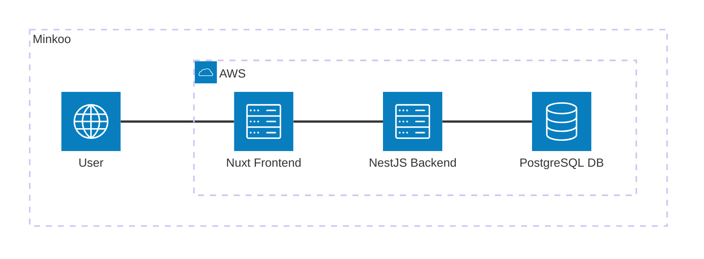

# Minkoo
> [!IMPORTANT]  
> Work in progress

## Architecture overview

## Related repositories
- [digivoro/minkoo-front](https://github.com/digivoro/minkoo-front) - Nuxt frontend
- [digivoro/minkoo-back](https://github.com/digivoro/minkoo-back) - NestJS backend

## Local development
### Prerequisites
> [!IMPORTANT]  
> Work in progress

### Quick start
1. Clone repositories
2. Copy environment files
3. Start application
4. Visit http://localhost:3000 to see the application running

## Deployment
> [!IMPORTANT]  
> Work in progress

## Features
> [!IMPORTANT]  
> Work in progress