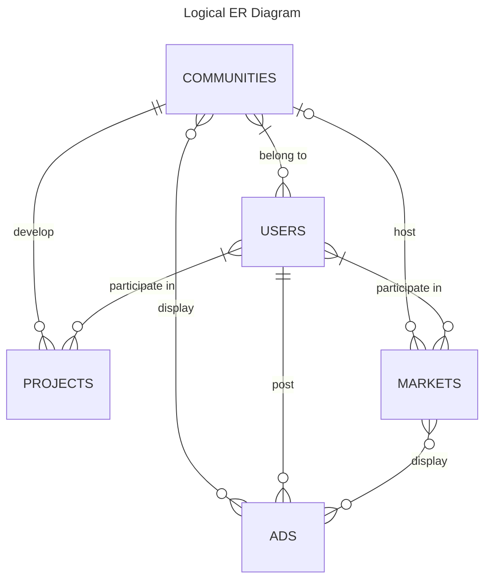
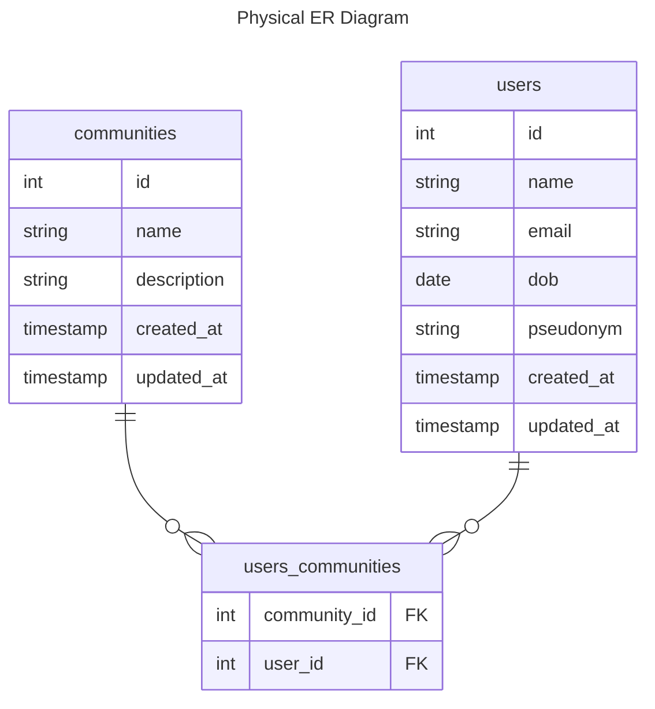

# Minkoo Data Model

```mermaid
---
title: "Logical ER Diagram"
---
erDiagram
  COMMUNITIES }|--o{ USERS : "belong to"
  COMMUNITIES ||--o{ PROJECTS : "develop"
  COMMUNITIES |o--o{ MARKETS : "host"
  COMMUNITIES }o--o{ ADS : "display"
  USERS }|--o{ PROJECTS : "participate in"
  USERS }|--o{ MARKETS : "participate in"
  USERS ||--o{ ADS : "post"
  MARKETS }o--o{ ADS : "display"
```

```mermaid
---
title: "Physical ER Diagram"
---
erDiagram
  communities ||--o{ users_communities : ""
  users ||--o{ users_communities : ""


  communities {
    int id
    string name
    string description
    timestamp created_at
    timestamp updated_at
  }
  users {
    int id
    string name
    string email
    date dob
    string pseudonym
    timestamp created_at
    timestamp updated_at
  }
  users_communities {
    int community_id FK
    int user_id FK
  }
```
