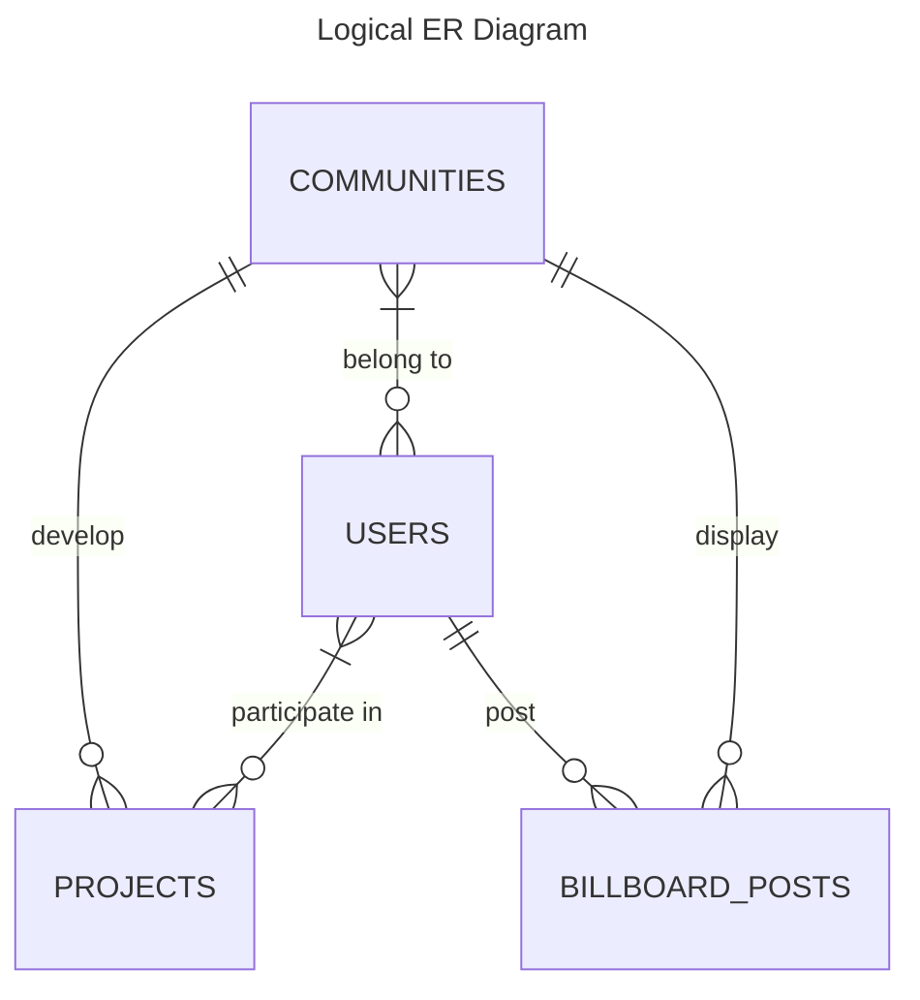
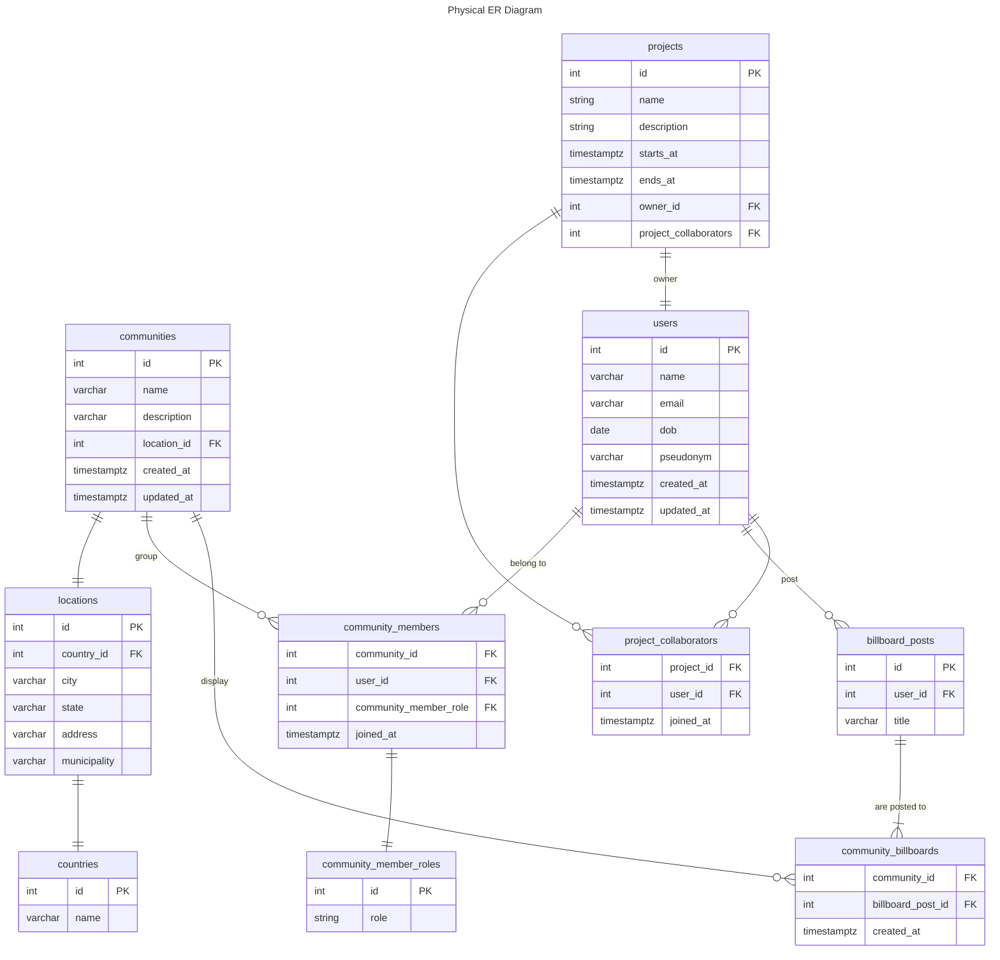

# Minkoo Data Model

```mermaid
---
title: "Logical ER Diagram"
---
erDiagram
  COMMUNITIES ||--o{ PROJECTS : "develop"
  COMMUNITIES }|--o{ USERS : "belong to"
  USERS }|--o{ PROJECTS : "participate in"
  COMMUNITIES ||--o{ BILLBOARD_POSTS : "display"
  USERS ||--o{ BILLBOARD_POSTS : "post"
```

```mermaid
---
title: "Physical ER Diagram"
---
erDiagram
  communities ||--|| locations : ""
  community_members ||--|| community_member_roles : ""
  communities ||--o{ community_members : "group"
  users ||--o{ community_members : "belong to"
  users ||--o{ billboard_posts : "post"
  projects ||--o{ project_collaborators : ""
  projects ||--|| users : "owner"
  locations ||--|| countries : ""
  communities ||--o{ community_billboards : "display"
  billboard_posts ||--|{ community_billboards : "are posted to"
  users ||--o{ project_collaborators : ""

  communities {
    int id PK
    varchar name
    varchar description
    int location_id FK
    timestamptz created_at
    timestamptz updated_at
  }
  users {
    int id PK
    varchar name
    varchar email
    date dob
    varchar pseudonym
    timestamptz created_at
    timestamptz updated_at
  }
  billboard_posts {
    int id PK
    int user_id FK
    varchar title
  }
  projects {
    int id PK
    string name
    string description
    timestamptz starts_at
    timestamptz ends_at
    int owner_id FK
    int project_collaborators FK
  }

  %% Junction tables
  community_members {
    int community_id FK
    int user_id FK
    int community_member_role FK
    timestamptz joined_at
  }
  community_billboards {
    int community_id FK
    int billboard_post_id FK
    timestamptz created_at
  }
  project_collaborators {
    int project_id FK
    int user_id FK
    timestamptz joined_at
  }

  %% Aux
  locations {
    int id PK
    int country_id FK
    varchar city
    varchar state
    varchar address
    varchar municipality
  }
  countries {
    int id PK
    varchar name
  }
  community_member_roles {
    int id PK
    string role
  }
```
